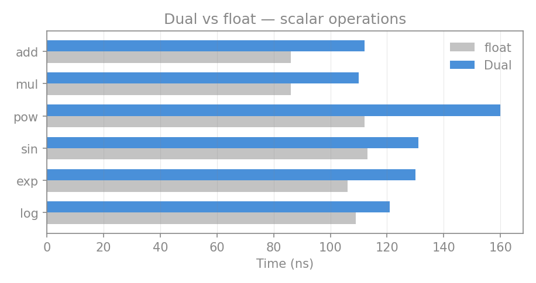
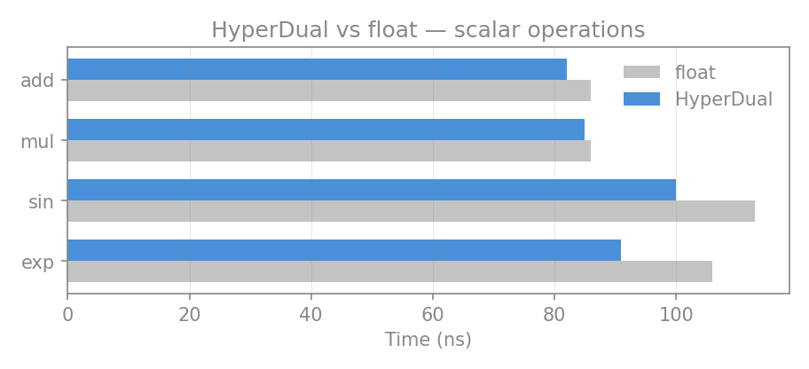
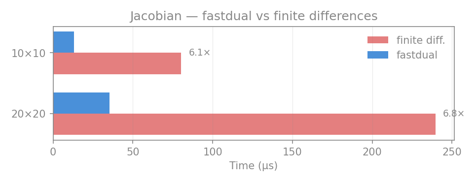
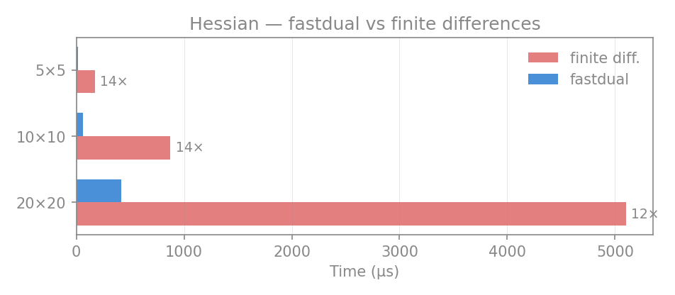
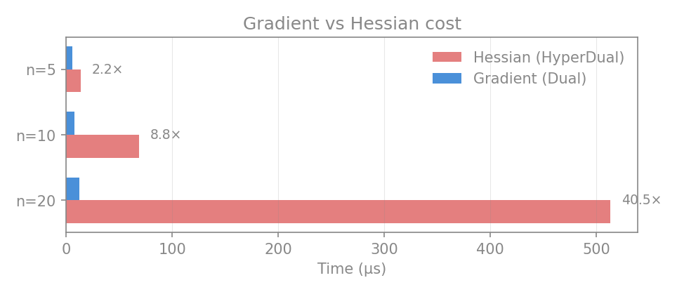

# fastdual

Fast forward-mode automatic differentiation via dual numbers, implemented as a CPython C extension.

Computes exact gradients, Jacobians, and Hessians with minimal overhead — no taping, no graph construction, just numbers that carry their derivatives.

## Install

```bash
pip install fastdual
```

## Drop-in Gradients

Any function that works with floats works with `Dual` — no rewriting, no framework, no JIT warmup:

```python
from fastdual import Dual, der

def my_function(x):
    return x**3 - 2*x + 1

x = Dual(3.0)
y = my_function(x)
dy_dx = der(y, x)  # 25.0 (exact derivative)
```

## Quick Start

```python
from fastdual import Dual, der
import numpy as np

x = Dual(3.0)
y = Dual(5.0)

z = x * y + np.sin(x)
print(z.val)        # 15.1411...
print(der(z, x))    # 5.99 (dz/dx = y + cos(x))
print(der(z, y))    # 3.0  (dz/dy = x)
```

## Multiple Variables

```python
from fastdual import Dual, der, val, jac
import numpy as np

xs = Dual.from_array([1.0, 2.0, 3.0])  # list of independent seeds

result = [np.sin(x) + x ** 2 for x in xs]
print(val(result))     # [sin(1)+1, sin(2)+4, sin(3)+9]
print(jac(result, xs)) # diagonal Jacobian
```

## Automatic Jacobians

```python
from fastdual import autojac
import numpy as np

@autojac
def f(x, y):
    return np.array([x**2 + y, x * y**2])

result, J = f(2.0, 3.0)
# result = [7.0, 18.0]
# J = [[4.0,  1.0],
#      [9.0, 12.0]]
```

## Automatic Hessians

Second-order derivatives via hyper-dual numbers (also a C extension):

```python
from fastdual import autohess

@autohess
def rosenbrock(x, y):
    return (1.0 - x)**2 + 100.0 * (y - x**2)**2

result, H = rosenbrock(1.0, 1.0)
# result = 0.0
# H = [[802, -400],
#      [-400, 200]]
```

## NumPy Integration

Scalar `Dual` numbers work with NumPy ufuncs via `__array_ufunc__`:

```python
from fastdual import Dual, der
import numpy as np

x = Dual(1.0)
np.sin(x)    # returns Dual with correct derivative
np.exp(x)    # all standard ufuncs supported
```

## Supported Operations

Both `Dual` (first-order) and `HyperDual` (second-order) types are C extensions. All operations work as methods and (for `Dual`) as NumPy ufuncs.

### Arithmetic

| Operation | Syntax | Dual | HyperDual |
|-----------|--------|:----:|:---------:|
| Addition | `a + b` | yes | yes |
| Subtraction | `a - b` | yes | yes |
| Multiplication | `a * b` | yes | yes |
| Division | `a / b` | yes | yes |
| Floor division | `a // b` | yes | — |
| Modulo | `a % b` | yes | — |
| Power | `a ** b` | yes | yes |
| Negation | `-a` | yes | yes |
| Absolute value | `abs(a)` | yes | yes |

### Transcendental Functions

Available as methods (`.sin()`) on both types and via NumPy ufuncs (`np.sin()`) on `Dual`.

| Function | Method | Derivative |
|----------|--------|------------|
| `sin` | `.sin()` | cos(x) |
| `cos` | `.cos()` | -sin(x) |
| `tan` | `.tan()` | sec²(x) |
| `exp` | `.exp()` | exp(x) |
| `log` | `.log()` | 1/x |
| `sqrt` | `.sqrt()` | 1/(2√x) |
| `arcsin` | `.arcsin()` | 1/√(1-x²) |
| `arccos` | `.arccos()` | -1/√(1-x²) |
| `arctan` | `.arctan()` | 1/(1+x²) |
| `sinh` | `.sinh()` | cosh(x) |
| `cosh` | `.cosh()` | sinh(x) |
| `tanh` | `.tanh()` | sech²(x) |
| `arcsinh` | `.arcsinh()` | 1/√(1+x²) |
| `arccosh` | `.arccosh()` | 1/√(x²-1) |
| `arctanh` | `.arctanh()` | 1/(1-x²) |
| `exp2` | `.exp2()` | ln(2)·2ˣ |
| `log2` | `.log2()` | 1/(x·ln2) |
| `log10` | `.log10()` | 1/(x·ln10) |
| `log1p` | `.log1p()` | 1/(1+x) |
| `expm1` | `.expm1()` | exp(x) |
| `square` | `.square()` | 2x |
| `cbrt` | `.cbrt()` | 1/(3x^⅔) |

### Binary Functions (Dual only)

These are available via NumPy ufuncs on `Dual`.

| Function | Usage | Description |
|----------|-------|-------------|
| `arctan2` | `np.arctan2(y, x)` | Two-argument arctangent |
| `hypot` | `np.hypot(a, b)` | √(a² + b²) with gradient |
| `maximum` | `np.maximum(a, b)` | Element-wise maximum |
| `minimum` | `np.minimum(a, b)` | Element-wise minimum |
| `copysign` | `np.copysign(a, b)` | Magnitude of a, sign of b |

### Utility Functions

| Function | Method | Dual | HyperDual |
|----------|--------|:----:|:---------:|
| `sign` | `.sign()` | yes | yes |
| `fabs` | `.fabs()` | yes | yes |
| `conjugate` | `.conjugate()` | yes | yes |
| `floor` | `.floor()` | yes | yes |
| `ceil` | `.ceil()` | yes | yes |

### Predicates (Dual only)

`np.isfinite()`, `np.isinf()`, `np.isnan()` — check the primal value, return `bool`.

### Comparisons

`<`, `<=`, `==`, `!=`, `>`, `>=` — compare on primal value only.

## API Reference

| Function | Description |
|----------|-------------|
| `Dual(value)` | Create an independent variable (seed) |
| `Dual.from_array(values)` | Create a list of independent seeds from floats |
| `der(result, wrt)` | Partial derivative of result w.r.t. a seed |
| `val(array)` | Extract primal values from Dual array |
| `jac(results, seeds)` | Full Jacobian matrix |
| `@autojac` | Decorator: `fn(*floats) -> (values, jacobian)` |
| `HyperDual(f, f1, f2, f12)` | Hyper-dual number for second derivatives |
| `@autohess` | Decorator: `fn(*floats) -> (result, hessian)` via hyper-dual numbers |

## Performance

All hot paths are in C — both `Dual` and `HyperDual` types are C extensions with zero Python object allocation in the inner loop.

### Dual: overhead vs plain floats



<!-- BENCH:OVERHEAD:START -->
| Operation | Dual | float | overhead |
|-----------|------|-------|----------|
| Scalar add | 112 ns | 86 ns | 1.3x |
| Scalar mul | 109 ns | 85 ns | 1.3x |
| Scalar pow | 160 ns | 110 ns | 1.5x |
| sin | 127 ns | 110 ns | 1.1x |
| exp | 128 ns | 107 ns | 1.2x |
| log | 120 ns | 112 ns | 1.1x |
<!-- BENCH:OVERHEAD:END -->

### HyperDual: overhead vs plain floats



<!-- BENCH:HDOVERHEAD:START -->
| Operation | HyperDual | float | overhead |
|-----------|-----------|-------|----------|
| Scalar add | 82 ns | 86 ns | 1.0x |
| Scalar mul | 84 ns | 85 ns | 1.0x |
| sin | 100 ns | 110 ns | 0.9x |
| exp | 92 ns | 107 ns | 0.9x |
<!-- BENCH:HDOVERHEAD:END -->

> HyperDual carries 4 fixed doubles — no sparse gradient bookkeeping. Per-element arithmetic is nearly free compared to floats.

### Jacobian: fastdual vs finite differences



<!-- BENCH:COMPARISON:START -->
| Benchmark | fastdual | fin. diff. | speedup |
|-----------|---|---|---|
| Jacobian 10x10 | 12.2 us | 75.1 us | **6.2x faster** |
| Jacobian 20x20 | 32.6 us | 215.3 us | **6.6x faster** |
<!-- BENCH:COMPARISON:END -->

> Jacobians use the C extension for forward-mode AD — one pass computes all partials simultaneously, vs n+1 function evaluations for finite differences.

### Hessian: fastdual vs finite differences



<!-- BENCH:HESSIAN:START -->
| Benchmark | fastdual | fin. diff. | speedup |
|-----------|---|---|---|
| Hessian 5x5 | 14.3 us | 173.8 us | **12.1x faster** |
| Hessian 10x10 | 68.9 us | 880.3 us | **12.8x faster** |
| Hessian 20x20 | 415.7 us | 5.2 ms | **12.5x faster** |
<!-- BENCH:HESSIAN:END -->

> Hessians require n(n+1)/2 function evaluations (each with HyperDual arithmetic). For small n, finite differences with simple functions can be competitive. The hyper-dual approach shines when derivatives must be **exact** (no step-size tuning) or when the function involves transcendentals where finite-difference errors grow.

### Gradient vs Hessian

How much more does a Hessian cost compared to a gradient for the same function?



<!-- BENCH:GRADVSHESS:START -->
| Size | Gradient (Dual) | Hessian (HyperDual) | ratio |
|------|-----------------|---------------------|-------|
| 5 variables | 5.9 us | 14.3 us | 2.4x |
| 10 variables | 7.5 us | 68.9 us | 9.1x |
| 20 variables | 11.8 us | 415.7 us | 35.1x |
<!-- BENCH:GRADVSHESS:END -->

> Dual computes the full gradient in a single forward pass but carries a sparse gradient vector that grows with the number of variables. HyperDual uses 4 fixed doubles per element (no per-variable scaling), but needs n(n+1)/2 passes for the full Hessian. The ratio reflects this: Hessians are roughly O(n²) more expensive than gradients.

## Test

```bash
pytest tests/ -v
```
